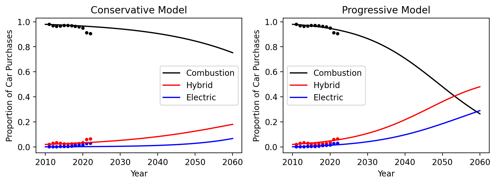
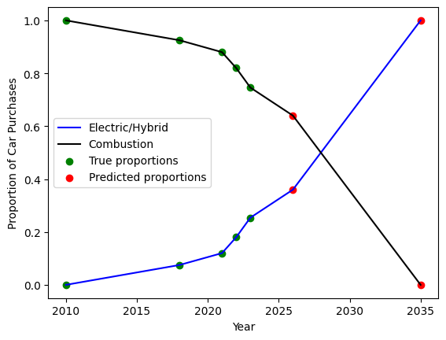
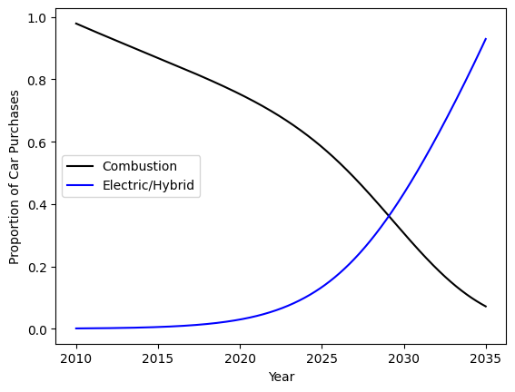
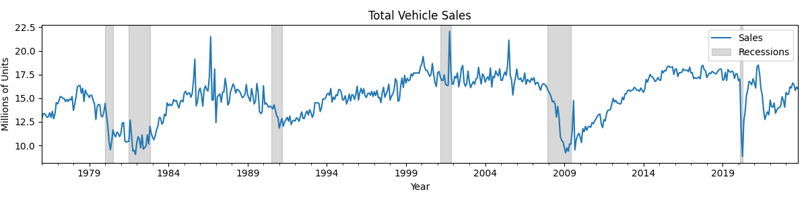
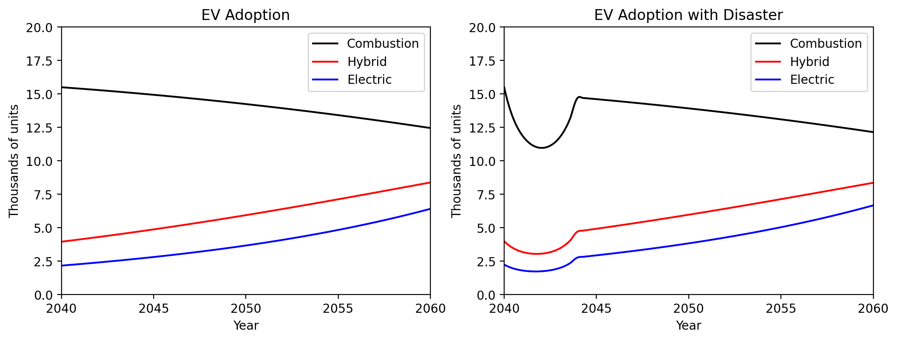
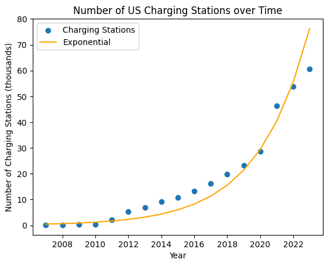
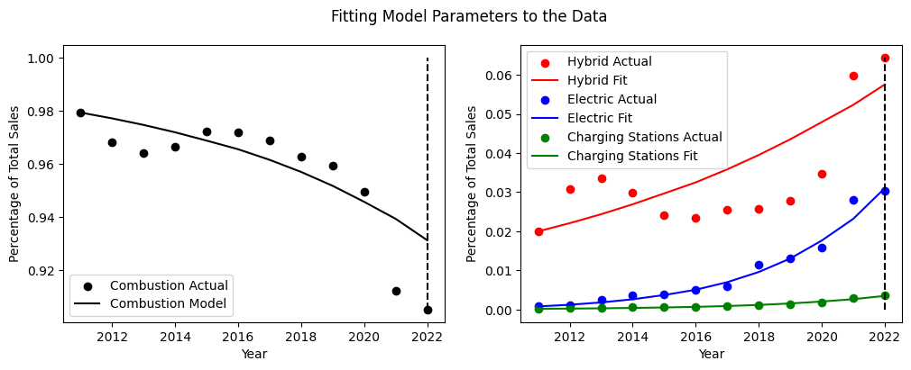
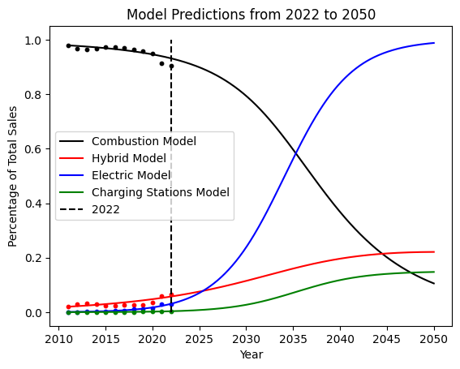

# Keeping Up with the Jones': Electric Vehicle Adoption in the U.S.

By Dallin Stewart, Jeff Hansen, Eliza Powell, Gwen Martin

December 7, 2023

## Abstract

In this study, we endeavor to model the production and adoption of combustion, hybrid, and electric vehicles in the United States from 2010 into the near future. We explore the dynamics influenced by societal behaviors, cultural dynamics, and social interactions due to government regulations, economic disasters, and the growth of charging infrastructure. Our analyses reveal a shifting trend towards electric vehicles, emphasizing the need for proactive infrastructure development. This study lays the groundwork for assessing the myriad of influences on the adoption of alternative vehicles, and contributes to a more informed and realistic understanding of future automotive landscapes.

## Background and Motivation

We seek to model the production of combustion, hybrid, and electric vehicles (EVs) in the United States from 2010 into the near future. Electric vehicles are crucial in mitigating climate change by reducing greenhouse gas emissions and dependence on fossil fuels. Modeling their adoption over time aids in understanding societal transitions to cleaner and sustainable transportation, guiding policy decisions and infrastructure development toward a more sustainable future.

Automotive companies first began producing hybrid vehicles in 1999, but the first fully electric vehicles were not commercially available until 2010. Since then, demand for these types of vehicles has increased significantly. We model the adoption of hybrid and electric vehicles over time since 2010 with a modified SIR model. While there are many factors that influence which types of vehicles companies produce and sell in the United States, we rely primarily on the effect that the relative population of each type of car has on the other populations. While cars do not directly influence each other in this way, this dynamic emerges from of people's decisions, which do affect each other. For example, local cultural values transmit as people exchange ideas and share their priorities. In addition, people with more friends and associates who own hybrid or electric vehicles are more likely to make a similar purchase. By incorporating the effect of social influence and cultural dynamics within our modified SIR model, we strive to better understand the intricate interactions shaping the adoption of hybrid and electric vehicles. This assumption acknowledges the significance of societal behaviors in steering the future landscape of sustainable transportation.

This model is helpful for navigating the dynamics of vehicle production, adoption, and sustainability. By examining the patterns of hybrid and electric vehicle adoption, our research offers practical insights for policymakers. These insights can inform decisions on infrastructure development, economic policies, and environmental impact goals. Understanding the factors that determine the adoption of sustainable transportation fosters a more informed and effective approach in shaping the future of the automotive industry and society as a whole.

Prior research on modeling EV adoption commonly relies on statistical, econometric, and machine learning models rather than ordinary differential equations \cite{afandizadeh2023using}, \cite{9162026}, \cite{SALARI202260}. For example Javid and Nejat sought to measure EV adoption and its effect on greenhouse gas emissions \cite{nejat2017}. Their approach relies on techniques such as mixed logit, generalized extreme value, and probit statistical models. After reviewing current research and studies on this topic, we observe that previous models primarily employed data-driven approaches like these to understand the determinants of consumer EV purchasing behavior rather than predictive dynamical models like the one we present here. 

## Modeling

We model electric vehicle adoption with a modified SIR model with three states: combustion (C), hybrid  (H), and electric (E). While we constrain the total population to a constant, and model each population as a ratio of the entire population. These constraints ensure  the ratios will always sum to one. The initial conditions in each version of the model presented are the ratios of car purchases in 2010, since this was the first year that EVs were commercially available \cite{doe2022}.

For more clear control over the model, the parameters that dictate the interaction and transition between states are determined by the states in question. For example, $ch$ indicates the rate of transition from combustion to hybrid vehicles, while $hc$ indicates hybrid to combustion transitions.
See Table 1 for more details. The model computes the difference before creating the differential equation. We explore multiple scenarios in the Results section, and each will vary from the model presented below by including additional terms or modifying these parameters. 

| Equation | Differential Equation |
|----------|-----------------------|
| $\dot{C}$ | $(hc - ch) \cdot C(t) \cdot H(t) + (ec - ce) \cdot C(t) \cdot E(t)$ |
| $\dot{H}$ | $(ch - hc) \cdot C(t) \cdot H(t) + (eh - he) \cdot H(t) \cdot E(t)$ |
| $\dot{E}$ | $(ce - ec) \cdot C(t) \cdot E(t) + (he - eh) \cdot H(t) \cdot E(t)$ |

| Parameters | Rate of Transition From |
|------------|-------------------------|
| `hc`       | Hybrid to Combustion    |
| `ch`       | Combustion to Hybrid    |
| `ce`       | Combustion to Electric  |
| `ec`       | Electric to Combustion  |
| `he`       | Hybrid to Electric      |
| `eh`       | Electric to Hybrid      |

## Results

We begin our investigation with a conservative model of electric vehicle adoption, assuming current conditions and perceptions do not change significantly. Since transportation industries do not directly measure or record the rate of transition between vehicles types in the United States, we must instead rely on total sales data in order to determine these coefficients. Based on vehicle proportion data \cite{doe2022}, we fine-tuned the parameters to most closely align historical proportion patterns while also yielding a conservative approach to electric adoption. Under these conditions, $hc-ch=-0.05$, $ec-ce=-0.09$, and $eh-he=-0.19$. This model indicates that people who already own a hybrid vehicle (green) transition most to a new electric vehicle, but more people transition from combustion to hybrid or electric than the opposite direction. See the Conservative Model in the figure below.

However, a model that more closely matches the historical data implies a much more drastic shift in electric vehicle adoption. We tune the parameters of our conservative model to $hc-ch=-0.09$, $ec-ce=-0.09$, and $eh-he=-0.02$. We also incorporate an additional term to the rate of change in the population of electric vehicles, $e=0.0007$. This addition changes the model from a pure SIR model to $\dot E = (ce - ec) \cdot C(t) \cdot E(t) + (he - eh) \cdot H(t) \cdot E(t) + e$.

In this projection, the total population of vehicles increases because of the rise in electric vehicles, but the transition between hybrid and electric vehicles and vice versa is much more equal. See the Progressive Model in the following figure.

*Model predictions, without explicitly accounting for outside influences. Scattered data represents real ratios of combustion, hybrid, and electric car sales. (Source: U.S. Department of Energy).*

Armed with these models in isolation, we now consider how additional factors might influence the future adoption of these alternative vehicles.

### Phasing Out Combustion Vehicles: California Regulation

In August 2022, California approved new legislation requiring all new cars sold after 2035 to be zero emission vehicles. According to the New York Times, California's vehicle conversion ``is widely expected to accelerate the global transition toward electric vehicles" \cite{davenport2022}. 
In an effort to analyze the production of vehicles in California, we examine in isolation the population of electric and combustion vehicles in the near future. This model reflects trends in California and predictions by Symon et al \cite{symon2023} based on the current conversion around electric sales in California. Because this data only measures electric vehicle production, we determine the proportion of combustion vehicles by calculating the remaining percentage.

*The following data was obtained by `California Globe' \cite{symon2023} and describes past proportions of vehicles in California as well as planned sales proportions for the future.*

In this scenario, we do not differentiate hybrid from electric, as the regulations only prohibits combustion car sales. Instead, we assume that the electric category includes any form of a zero emission vehicle, including battery electric vehicles, plug-in hybrid electric vehicles as well as fuel cell electric vehicles. Furthermore, we restrict this model to only account for the population of cars sold within the state of California. We thus arrive at the following dynamical model for California regulation of electric vehicles: 

$\dot{C} = (-0.4) \cdot C(t) \cdot E(t) + (-0.023) \cdot C(t)$

$\dot{E} = (0.3) \cdot C(t) \cdot E(t) + (0.1) \cdot E(t)$

*Modeled Proportion of Electric and Combustion Vehicles in California*

This model is unable to perfectly match reality, as the predicted proportions range between 0.05 and 0.17 while the true data reflects significant growth from 0.10 to 0.30. However, this model resembles the general shape and structure of the true data. By 2035, we see that the proportion of combustion sales falls near zero, while electric vehicles is approximately 1. 

### Disaster Effect

Incorporating the effects of economic disasters into our model is crucial for gaining a better understanding of how adverse conditions impact consumer behavior and the dynamics of vehicle sales. During recessions, consumers tend to prioritize essential expenses and delay discretionary spending such as vehicle purchases. 
In order to understand the effect that a recession has on car sales, we first examine historical car sales in relation to economic recessions.

*Source: U.S. Bureau of Economic Analysis*

From this data, we see that as an economic disaster occurs, the total number of vehicle sales immediately decreases. After the recession has ended, the total number of car sales steadily increases back to its original equilibrium. We can predict the trajectory of car sales when an economic disaster occurs based on factors such as predicted length ($D$) and rate of intensity of the disaster ($r$). In addition, our model includes an upper limit ($U$), a lower limit ($L$), and reflects the total number of car sales ($S$). 

$\dot{S} = r \cdot S \cdot \left(1 - \frac{S - L}{U - L}\right) \cdot (t - D)$

We compare our disaster model to actual car sale data from the 2008 Housing Market crash and the Covid-19 Pandemic: 

*Source: U.S. Bureau of Economic Analysis*

We now transition from modeling the effects of a disaster on total car sales to the effects of the disaster on combustion, hybrid, and electric vehicle sales individually. We adjust the original model in the first figure to account for the effects of an economic disaster on each car type: 

$\dot{C} = (hc - ch) \cdot C(t) \cdot H(t) + (ec - ce) \cdot C(t) \cdot E(t) + c + R_1(t)$

$\dot{H} = (ch - hc) \cdot C(t) \cdot H(t) + (eh - he) \cdot H(t) \cdot E(t) + h + R_2(t)$

$\dot{E} = (ce - ec) \cdot C(t) \cdot E(t) + (he - eh) \cdot H(t) \cdot E(t) + e + R_3(t)$

In this system of equations, each $R_i = r  S  \left(1 + \frac{S - L_i}{L_i}\right)  (t - D)$ reflects the effect of the disaster corresponding to each vehicle type for the duration of the disaster. $L_i$ reflects the lower limit of each vehicle type. This value is proportional to each vehicle's initial condition, measured when the disaster strikes. We leave the upper limit as the default upper limit from the base model.

*Modeling the effects of a potential economic disaster in the year of 2040. Graph has been adjusted to reflect quantities of sales instead of proportion of sales.*

We can observe the adverse impact of the disaster on vehicle sales in the model, along with the subsequent rebound in sales for each vehicle type. This model aptly mirrors the overall shape and severity of genuine economic disasters, providing a solid foundation for sales predictions. However, over-idealism still limits the predictive power of the model. While the predicted rate of returning to normalcy precisely matches the rate of the initial decline, the true recovery pace is typically more gradual than the initial downturn. Simply put, the recovery period following a disaster tends to be lengthier than the time it takes to reach the peak of the crisis. This discrepancy becomes evident when examining car sales during the 2008 Housing Market crash (refer to the previous figure). Our model proves conservative during the crash and overly optimistic during the recovery phase. Delving deeper into these limitations promises a more nuanced understanding and, consequently, more accurate modeling results.

### Reliance on Charging Stations

When deciding to switch to an electric vehicle, consumers often consider the range that an EV can travel on a single charge. As companies provide more charging stations, EVs can travel farther, and this factor may appear more enticing to consumers. This relationship implies that the expansion of electric vehicle adoption is intimately linked to the availability of charging stations. To account for this relationship in our model, we include a fourth term $\dot S(t)$ to represent the number of charging stations in the US, and we update the $\dot E(t)$ term by adding $\alpha S(t)$. This term represents the number of additional EVs that people purchase because of the construction of charging stations. We also add an additional $(1 - E(t))$ factor and multiply this by the right-hand side of the $\dot E(t)$ equation to ensure that electric vehicles do not surpass 100\% of total sales. 

$\dot{E}(t) = \left[ (ce - ec) \cdot C(t) \cdot E(t) + (he - eh) \cdot H(t) \cdot E(t) + e + \alpha \cdot S(t) \right] \cdot (1 - E(t))$

In order to create the $\dot S(t)$ portion of the model, we found data regarding the number of charging stations in the US at the end of each year. As demonstrated in the following figure, the number of charging stations over time patterns exponential growth. A simple way to model this growth is $\dot S(t) = \beta S(t)$, but this causes the number of charging stations to grow to infinity. To combat this we add a discount factor $(1 - \frac{S(t)}{C_s})$. We claim that the number of charging stations will never surpass the number of current gas stations, which is roughly 168,000. So we set $C_s = 168,000$ when running the model. 

*The rate of charging stations is exponential overtime (Source: U.S. Department of Energy).*

Putting all of these additions together yields the system of equations:

$\dot{C}(t) = (hc - ch) \cdot C(t) \cdot H(t) + (ec - ce) \cdot C(t) \cdot E(t)$

$\dot{H}(t) = (ch - hc) \cdot C(t) \cdot H(t) + (eh - he) \cdot H(t) \cdot E(t)$

$\dot{E}(t) = \left[ (ce - ec) \cdot C(t) \cdot E(t) + (he - eh) \cdot H(t) \cdot E(t) + \alpha \cdot S(t) \right] \cdot (1 - E(t))$

$\dot{S}(t) = \beta S(t) \cdot \left(1 - \frac{S(t)}{C_s}\right)$

After iterative adjustments to the parameters in the above equations, we were able to fit the model's growth to the actual data between 2011 and 2022 (see the previous figure). We then extended the model to 2022-2050 while maintaining the same initial conditions and parameters to estimate the future growth of each type of vehicle and charging station. As seen in the previous figure, we project that EVs will surpass combustion vehicles in the year 2035. Examining at the red line representing the charging stations, we can see that the growth is exponential between 2011 to around 2035, but diminishes as the population approaches the critical capacity. Finally, we note that the overall system reaches a steady equilibrium where EVs represent the majority of the total purchases, hybrid vehicles represent a portion of the sales, no more charging stations are constructed, and combustion vehicle purchases tend to 0. 

*Our model's parameters are adjusted to match empirical data from 2011-2022*

*After fitting the model to 2011-2022 data, it makes predictions from 2022-2050*

## Analysis and Conclusion

Across all analyzed factors, we observe a consistent upward trend in the adoption of hybrid and electric vehicles, coupled with a decline in combustion vehicles. This trend underscores the imperative for proactive measures as the production of electric vehicles expands. Policymakers should consider strategic initiatives, such as incentivizing the widespread development of charging infrastructure to support the increasing demand for electric vehicles. Additionally, these insights highlight the importance of formulating policies that encourage sustainable transportation practices, fostering a transition toward cleaner and more environmentally friendly vehicle options. This proactive approach not only aligns with environmental goals but also supports the evolving preferences of consumers, ultimately shaping a more sustainable future for the automotive industry. 

We began the process of modeling electric vehicle adoption by starting with a very simple framework based on an SIR model. We then explored various potential situations that we hypothesized would have a significant effect on people's car purchasing designs in the United States. While each of these variations reflect the changes to the model accurately, they all suffer from the same fundamental simplification. We assume that the size of each population is the primary influence on the rate of adoption, similar to the transmission of disease. However, this idea of cultural influence and local proliferation on vehicle purchases is certainly not the only factor affecting the type of car people choose to purchase.

A more appropriate model would allow the transition rate parameters to change with respect to time to incorporate more factors like changing views on electric cars, variations in relative prices, and developments in government incentive programs in a more complex and realistic manner. Furthermore, we could explore a broader range of scenarios. For instance, an examination of the production proportions of electric, hybrid, and combustion vehicles within individual car manufacturing companies may provide insights into economic trends and other behavioral patterns. Rather than addressing these factors individually, our eventual goal is to integrate them into a comprehensive model that can collectively consider multiple variables. By consolidating factors like government incentives, charging resource limitations, and the impact of natural disasters, this unified model would offer a more cohesive framework. This integrated approach not only helps in eliminating unrealistic assumptions but also ensures that the model encompasses all discussed situations, creating a more comprehensive and robust analytical tool.

## References

#### Symon, E. (2023). 25.4% Of All New Cars Sold In California Now Electric
- **Source:** [California Globe](https://californiaglobe.com/fr/25-4-of-all-new-cars-sold-in-california-now-electric/#:~:text=According\%20to\%20a\%20new\%20California,electric\%20car\%20sales\%20by\%202035.)
  
#### Davenport, Coral, Friedman, Lisa, & Plumer, Brad (2022). California to Ban the Sale of New Gasoline Cars
- **Source:** [The New York Times](https://www.nytimes.com/2022/08/24/climate/california-gas-cars-emissions.html)

#### U.S. Bureau of Economic Analysis (2023). Total Vehicle Sales
- **Source:** [Federal Reserve Bank of St. Louis](https://fred.stlouisfed.org/series/TOTALSA)

#### U.S. Department of Energy (2023). Alternative Fueling Station Counts by State
- **Source:** [AFDC - Alternative Fuels Data Center](https://afdc.energy.gov/stations/states)

#### U.S. Department of Energy, Energy Vehicle Technologies Office, Oak Ridge National Laboratory (2022). Transportation Energy Data Book, Edition 40, Table 6.2
- **Source:** [Available at TEDB](https://tedb.ornl.gov/data/), as of Jun. 21

#### Nejat, Jarvid (2017). A Comprehensive Model of Regional Electric Vehicle Adoption and Penetration

#### Afandizadeh, S., Sharifi, D., Kalantari, N., et al. (2023). Using machine learning methods to predict electric vehicles penetration in the automotive market
- **Source:** [Scientific Reports](https://doi.org/10.1038/s41598-023-35366-3)

#### Jia, Jianmin, Shi, Baiying, Che, Fa, & Zhang, Hui (2020). Predicting the Regional Adoption of Electric Vehicle (EV) With Comprehensive Models
- **Source:** [IEEE Access](https://doi.org/10.1109/ACCESS.2020.3014851)

#### Salari, Nasir (2022). Electric vehicles adoption behaviour: Synthesising the technology readiness index with environmentalism values and instrumental attributes
- **Source:** [Transportation Research Part A: Policy and Practice](https://doi.org/10.1016/j.tra.2022.07.009)
